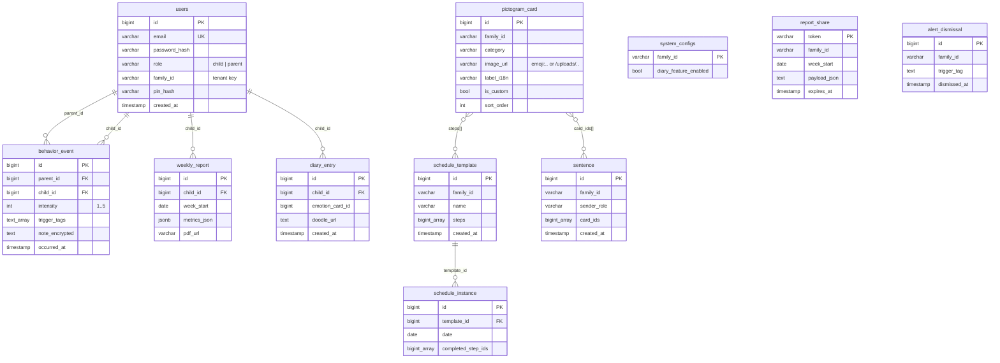

# 🗄️ VisiTalk — Database ER Diagram

PostgreSQL 17 (Neon) · 11 tables · source of truth: `backend/src/main/resources/schema.sql`

> **For your slide:** use [er-diagram.svg](er-diagram.svg) — it's **vector**, so it
> stays crisp at any zoom (no blurry text). A hi-res [er-diagram.png](er-diagram.png)
> (3136×1108) is also included. The ```mermaid``` block below is the editable source.





## Reading the diagram

- **Solid foreign keys** (`REFERENCES`): `behavior_event.parent_id / child_id`,
  `weekly_report.child_id`, `diary_entry.child_id` → `users.id`;
  `schedule_instance.template_id` → `schedule_template.id`.
- **Array references** (Postgres `bigint[]`, dashed many-to-many):
  `sentence.card_ids[]` and `schedule_template.steps[]` point at `pictogram_card.id`.
- **`family_id` is the multi-tenant partition key.** Every family-scoped table
  (`users`, `pictogram_card`, `sentence`, `schedule_template`, `system_configs`,
  `report_share`, `alert_dismissal`) carries it, so all queries filter by family —
  one database, isolated per family.

## The three feature modules map onto the tables

| Module | Tables |
|---|---|
| **A — PECS / communication** | `pictogram_card`, `sentence` |
| **B — Visual schedule** | `schedule_template`, `schedule_instance` |
| **C — Behavior / report / diary** | `behavior_event`, `weekly_report`, `diary_entry`, `alert_dismissal`, `report_share` |
| Cross-cutting | `users` (auth + family), `system_configs` (per-family toggles) |
